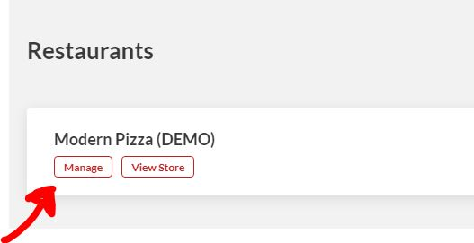
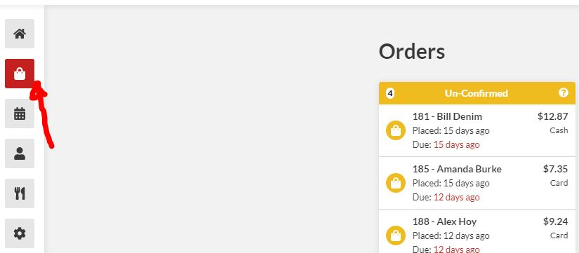
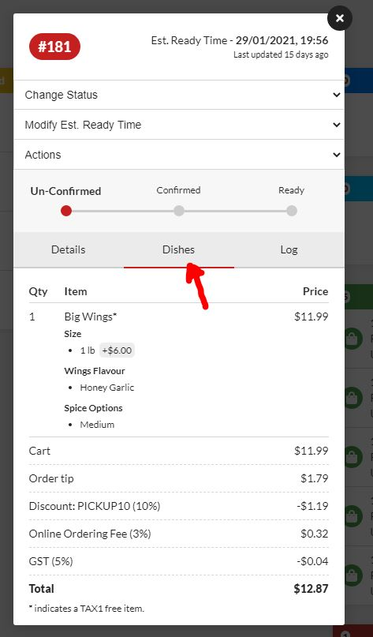
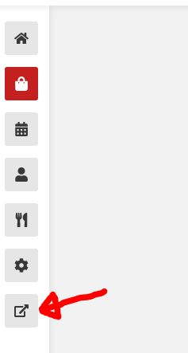

# 10-Minute Quickstart

## GET STARTED

#### LOGGING INTO TO TAKE ORDERS

Login to your admin dashboard using the username/password below [**https://admin.theorderguys.com/login**](https://admin.theorderguys.com/login)\*\*\*\*

#### 2. MANAGE YOUR ORDERS

You will be able to view all orders and manage them to fit your restaurant's requirements. 

By default, all orders will be auto-confirmed with pickup time as 15 minutes. You can change these settings easily. Instructions for that will be in **configure your services** but you can also send us a quick note of how you like things and we will do it for you.

To view the order details simply click/tap on one of the orders and click "details" Under "dishes" you will see exactly what the customer has ordered. You can also get an email pdf receipt of this order. If you have a printer, this will be auto printed for you to make things even easier/faster.

#### 3. PLACE A TEST ORDER

The best way to get familiar is to actually try it out. Please go to the front end of your website menu and place a test order. You can go to the front end of your website menu by using the link given to your earlier in the email or clicking on the button below. This will open up a new window. 

If your website menu is not set up yet you can visit our demo website menu to place an order at [**https://modernpizza.theorderguys.com/**](https://modernpizza.theorderguys.com/)\*\*\*\*

## NEXT STEPS

At this point, you can customize the system as you please and start accepting orders. We recommend you continue reading the articles in this section. You will learn how to configure the system to your requirements and manage orders in-depth.

